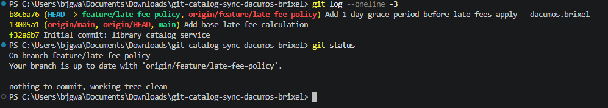
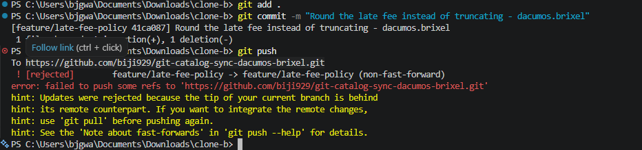
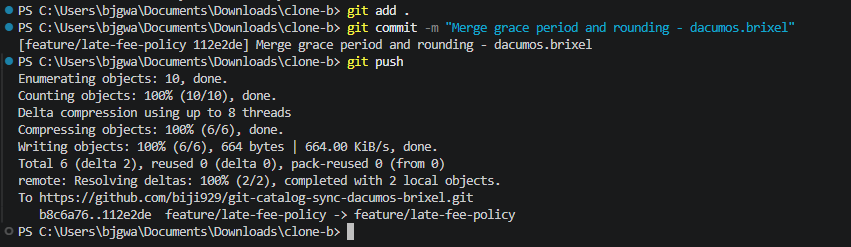
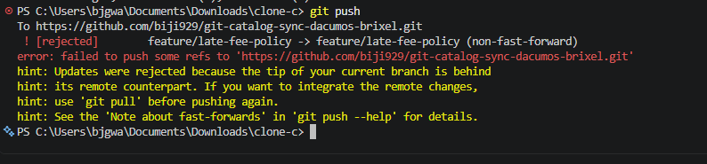
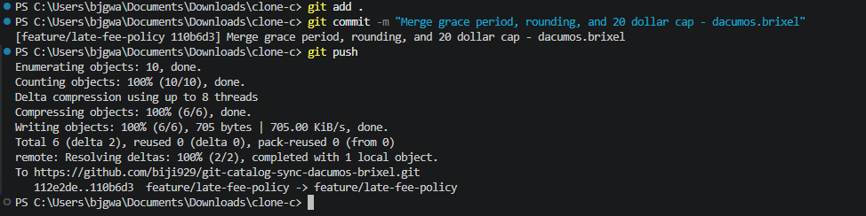
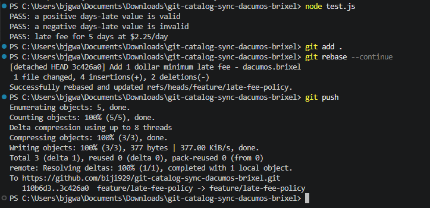
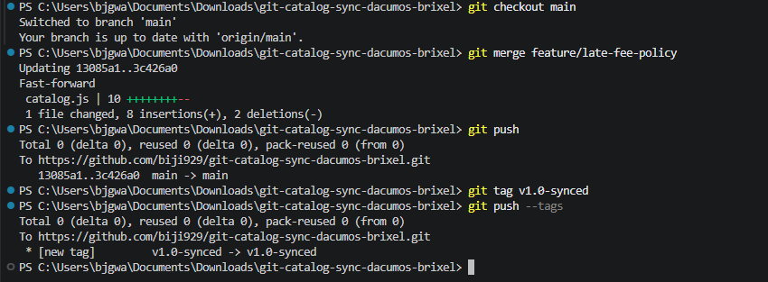

# Catalog Sync — WORKFLOW.md
**Name:** Brixel Jay Dacumos (dacumos.brixel)
**Repository:** git-catalog-sync-dacumos-brixel

---

## Task 1 — Clone A: Grace Period

Added a 1-day grace period to `calculateLateFee` and pushed cleanly.



---

## Task 2 — Clone B: Rounding (Rejected)

Changed the fee calculation to round instead of truncate. Push was rejected because Clone A had already pushed the grace-period change.



---

## Task 3 — Clone B: First Merge

Fetched and merged, resolving the conflict so both the grace period and rounding behaviors survive. Tests passed, pushed successfully.



---

## Task 4 — Clone C: Max Fee Cap (Rejected)

Added a $20 maximum fee cap. Push was rejected — the branch had moved twice since Clone C last saw it.



---

## Task 5 — Clone C: Three-Way Merge

Fetched and merged, resolving the conflict so grace period, rounding, and the $20 cap all survive together. Tests passed, pushed successfully.



---

## Task 6 — Clone A: Minimum Fee via Rebase

Added a $1 minimum fee. Push was rejected. Resolved with `git fetch` + `git rebase` instead of merge, handling conflicts across affected files so all four behaviors survive. Pushed without force.



---

## Task 7 — Merge to Main, Tag, Push

Merged `feature/late-fee-policy` into `main`, pushed, tagged the final commit `v1.0-synced`, and pushed the tag.



---

## Written Answers

### 1. Walk through the final `calculateLateFee` function and name which contributor's change is responsible for each part.

*(Paste your final function here, then explain line by line — e.g. the grace-period check came from Clone A/Task 1, the rounding came from Clone B/Task 3, the $20 cap came from Clone C/Task 5, the $1 minimum came from Clone A/Task 6.)*

```javascript
// paste final calculateLateFee here
```

- Line/part 1:
- Line/part 2:
- Line/part 3:
- Line/part 4:

### 2. Compare Task 3's two-way conflict to Task 5's three-way conflict — what got harder with a third line of work?

*(Your answer here — think about how a two-way conflict only requires interleaving two people's changes, while a three-way conflict requires reasoning about the correct combined *order of operations* across three sets of changes touching the same lines.)*

### 3. What's the actual difference between how you resolved Task 5 (merge) and Task 6 (rebase)?

*(Your answer here — think about merge commits vs. a rewritten linear history, and why no `--force` was needed for the rebase push.)*

### 4. If this were a real team of three, what one process change would have prevented all three rejected pushes?

*(Your answer here.)*
